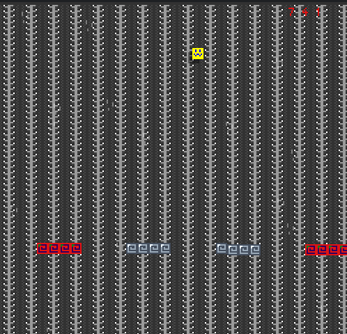

# The Fall

Author: Arthur Sokolov (asokolov)

Design: The Fall is a dropper style game where you are supposed to dodge obstacles the longer you survive the faster the game gets. How I made this interesting is there are impassable walls which you have to switch colours for making you juggle between multiple colours as you fall

Screen Shot:

How Your Asset Pipeline Works:

How I made it work is I have the original source file that being an 128 by 128 sprite sheet made in Aesprite and exported as a PNG. Next I grab the PNG file from the Assets folder and load it using "load_png". I purposefully designed the sprite sheet to consist of 256 8x8 blocks, so for any asset I would need, I would Specify a macro coordiante which points to one of the 8x8 tiles. From there I would scan through that 8x8 tile converting the colour RGB values into a luminosity value from which we generate the indexed pallete values. From these values we calculate and split the 2 bits to give us what we need.

(TODO: make sure the source files you drew are included. You can [link](Assets/Spritesheet.png) to them to be a bit fancier.)

How To Play:

Use the arrow Keys to move left and right to dodge the oncoming walls. If you hold down the spacebar you can pass through red walls but not normal walls. Be careful if you fail (score < 0) the program may terminate. Have fun :)

This game was built with [NEST](NEST.md).

